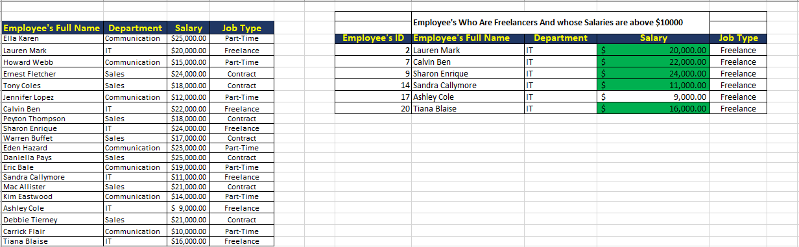
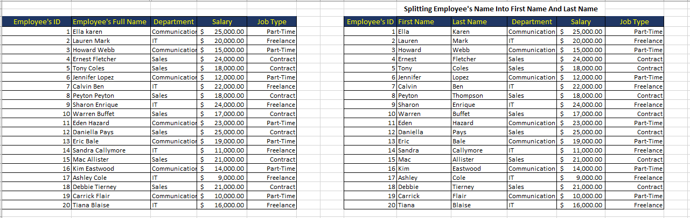
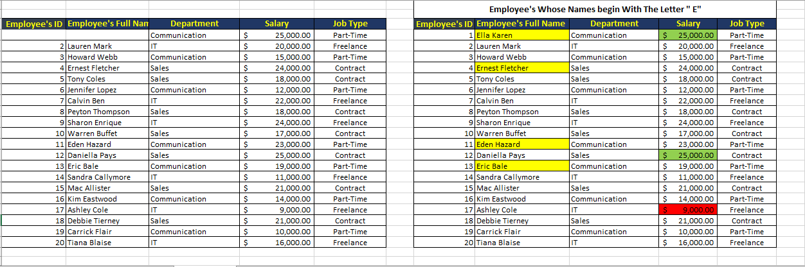

## **Task on Data entry,Manipulation and Formatting in MS EXCEL**
### **INTRODUCTION**
- The task is based on how to efficiently and effectively enter data,manipulate data,sorting and filtering data,apply conditional formatting,data validation and splitting data on MS EXCEL
- The task was to create a table with 20 rows of information having the fields as follows,Employee Full Name,Department(communications,sales,I.T),Salary(between $5000 to $25000) and Job type(Part-time,Freelance,Contract).
- ### **SKILLS/CONCEPTS INCORPORATED**
- ## Data Entry,Sorting & Filtering,Conditional Formatting,Data Validation,Splitting of data.
- ## PROBLEM STATEMENT
  In the task,it requires that the 20 rows of information is to be copied and pasted in two different worksheets,for the worksheet 1,it requires to show only Employees who are "Freelancers" and to also highlight the ones whose Salaries are above $10000.
- So the snapshot below clearly shows the 20 rows of information and also shows the Employees who are "Freelancers" and those whose salaries are above $10000 are highlighted in green colour.
- 
- ---
2.To Split Employees' full names into first name and last name,also to check for duplicates and highlight if any.
- In worksheet 2,it requires to split the employees' full name into first and last name and the snapshot below clearly shows Employees' Full Name splitted into first name and last name,there was no duplicate.

---
3. Highlight Employee whose names begin with the letter "E" and format salary column such that the highest salary has a green background and the lowest salary has a red background
- In sheet 3,it requires that Employees whose names begin with the letter "E" should be highlighted and also to format the salary column such that the highest salary have a green background and the lowest salary have a red background.the snapshot below clearly shows that.

### **CONCLUSION**
After imploring the skills of data entry,sorting & filtering of data,conditional formatting,data validation and splitting of data, it was possible to create a table with 20 rows of information,showed employees' who are freelancers only and whose salaries are above $10000,splitting of employees' full Names into first and last Names and lastly highlighting of employees' whose names begin with the letter "E" and formatting the Salary column such that the highest salary have a green background and the lowest salary have a red background

  
